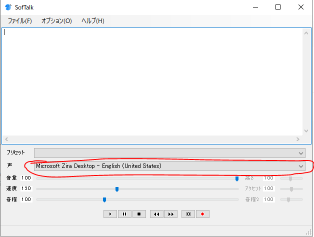
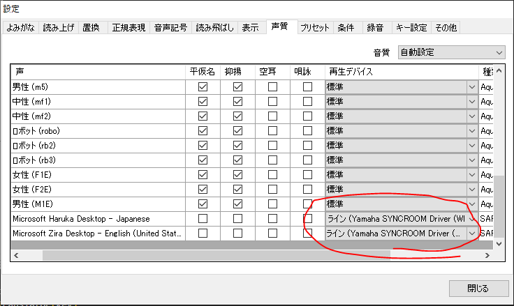

# RealtimeTranslate

Installation
========
0. If Python is not installed.  
If you do not have Python installed, please install it.(Python 3.8 is recommended, just in case.)  
[Python Download](https://www.python.org/downloads/release/python-380/)


1. Virtual audio driver installation.  
[Syncroom Download](https://syncroom.yamaha.com/play/dl/)


2. Install the module from PyPI.
```
pip install -r requirements.txt
```


3. Install the PyAudio from whl file.
```
pip install ./module/PyAudio-0.2.11-cp38-cp38-win_amd64.whl --user
```


Usage
========
1. Obtain API key for translator.  
※ You must enter your credit card information, but the free version does not require payment.(As of June 21, 2022)    
[Get Deepl API key](https://www.deepl.com/pro-api?cta=header-pro-api)

2. Enter the obtained API key into the config.  
Example : key = 12345678-9abc-def0-1234-56789abcde:fx


3. Execution method.  
```
python Translate.py
```


4. Stop method.  
When you say stop, it stops.


Config
========
- Softalk language settings.  
Start SofTalk.exe in the softalk file to set it up.  
Set the destination language.  



  - Change the location of the red circle in the image to Yamaha SYNCROOM Driver.(Destination language location.)  
  オプション->環境設定->声質
  


- Configuration of config.
  - API_KEY
    - key 		  : 	Deepl API Key.

  - TRANSLATE_SETTINGS
    - source_lang 	: 	The language you speak.
    - target_lang	:	Target language.

  - TALK_SETTINGS -
    - speed		:	Talk speed.
    - hide		:	Hide Softalk.


License
========
For files outside the softalk folder, the GNU General Public License v2.0 applie, see the LICENSE file.  
Please read the readme.txt file in the folder regarding the bundled softalk.
